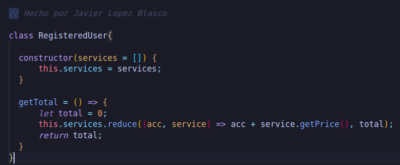

# Parte teórica

 1. Que problemas detectas en la operación?
> En el caso de que tengamos que añadir un nuevo tipo de servicio, tendremos que modificar el código "getTotal", por lo que podría producir algún error que afectase al calculo del precio de todos los servicios.

 2. Propón una solución alternativa (también en pseudocódigo del mismo estilo) que corrija los problemas de la operación getTotal de RegisteredUser que has detectado en la pregunta anterior. Realiza todos los cambios que consideres necesarios en cualquiera de las clases del modelo del enunciado.

> Creo que lo mejor sería que la función "getPrice" fuese heredada por sus hijos (DownloadService, StreamingService...). Así podríamos acceder al precio dependiendo de la modalidad. Por otro lado, MultimediaContent debería tener una función que calculase las "Fees" y que fuese heredada por PremiumContent, de esta manera nos podría devolver el valor de aditionalFee. Al hacer esto, podremos acceder a los precios y a las tarifas adicionales usando el metodo reducer. Por otro lado, al hacer esto estaríamos limitando el comportamiento de getPrice a simplemente calcular los precios que le llegan, lo que ayudaría a testearlo y a encontrar futuros errores.

